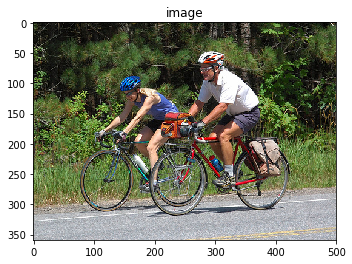

# 如何使用深度学习为照片自动生成文本描述

## 定义
对图像搜索和帮助视觉障碍者「查看」世界等应用而言，让图像带有文本描述是非常有价值的。使用人力标注显然不现实，而随着深度学习技术的发展，使用机器为图像自动生成准确的文本描述成为了可能。
## 难点
图像描述涉及到为给定图像（比如照片）生成人类可读的文本描述。这个问题对人类而言非常简单，但对机器来说却非常困难，因为它既涉及到理解图像的内容，还涉及到将理解到的内容翻译成自然语言。

## 如何描述图像
描述图像是指为图像（比如某个物体或场景的照片生成人类可读的文本描述）。这个问题有时成为自动图像标注或图像标注，这个问题对人类来说轻而易举，但对机器来说非常困难。要解决这个问题，既需要理解图像的内容，也需要将其中的含义用词语表达出来，并且所表达的词语必须以正确的方式串接起来才能被理解。这需要计算机视觉和自然语言处理结合起来，是广义的人工智能领域的一大难题。

### 神经描述图像
神经网络模型已经主导了自动描述生成领域；这主要是因为这种方法得到了当前最佳的结果。在端到端的神经网络模型之前，生成图像描述的两种主要方法是基于模板的方法和基于最近邻并修改已有描述的方法。
用于描述的神经网络模型涉及到两个主要元素：

* 特征提取
* 语言模型

#### 特征提取
特征提取模型是一种神经网络。给定一张图像，它可以提取出显著的特征，通常用固定长度的向量表示。提取出的特征是该图像的内部表征，不是人类可以直接理解的东西。用作特征提取子模型的通常是深度卷积神经网络（CNN）。这种网络可以在图像描述数据集中的图像上直接训练。或者可以使用预训练的模型（比如用于图像分类的当前最佳的模型），或者也可以使用混合方法，即使用预训练的模型并根据实际问题进行微调。


#### 语言模型
一般而言，当一个序列已经给出了一些词时，语言模型可以预测该序列的下一个词的概率。
对于图像描述，语言模型这种神经网络可以基于网络提取出的特征预测描述中的词序列并根据已经生成的词构建描述。
常用的方法是使用循环神经网络作为语言模型，比如长短期记忆网络（LSTM）。每个输出时间步骤都会在序列中生成一个新词。
然后每个生成的词都会使用一个词嵌入（比如 word2vec）进行编码，该编码会作为输入被传递给解码器以生成后续的词。
对该模型的一种改进方法是为输出序列收集词在词汇库中的概率分布并搜索它以生成多个可能的描述。这些描述可以根据似然（likelihood）进行评分和排序。常见的方式是使用波束搜索（Beam Search）进行这种搜索。
语言模型可以使用从图像数据集提取出的预计算的特征单独训练得到；也可以使用特征提取网络或某些组合方法来联合训练得到。


#### 编码器解码器架构
构建子模型的一种常用方法是使用编码器-解码器架构，其中两个模型是联合训练的。

>这种模型的基础是将图像编码成紧凑的表征的卷积神经网络，后面跟着一个循环神经网络来生成对应的句子。这种模型的训练目标是最大化给定图像的句子的似然。——《Show and Tell：一种神经图像描述生成器》，2015

这种架构原本是为机器翻译开发的，其中输入的序列（比如法语）会被一个编码器网络编码成固定长度的向量。然后一个分立的解码器网络会读取这些编码并用另一种语言（比如英语）生成输出序列。

除了能力出色外，这种方法的好处是可以在该问题上训练单个端到端模型。

当将该方法用于图像描述时，编码器网络使用了深度卷积神经网络，解码器网络则是 LSTM 层的堆叠。

> 在机器翻译中，「编码器」RNN 会读取源句子并将其转换成信息丰富的固定长度的向量表征，这种表征又会被用作「解码器」RNN 的初始隐藏状态，进而生成目标句子。我们在这里提出遵循这种优雅的方案，并使用深度卷积神经网络（CNN）替代编码器 RNN。——《Show and Tell：一种神经图像描述生成器》，2015

 

## keras生成图像描述实战


### 准备图像和描述数据集
图像字幕生成可使用的优秀数据集有 Flickr8K 数据集。原因在于它逼真且相对较小，即使你的工作站使用的是 CPU 也可以下载它，并用于构建模型。
作者对该数据集的描述如下：
> 我们介绍了一种用于基于句子的图像描述和搜索的新型基准集合，包括 8000 张图像，每个图像有五个不同的字幕描述对突出实体和事件提供清晰描述。
图像选自六个不同的 Flickr 组，往往不包含名人或有名的地点，而是手动选择多种场景和情形。

该数据集的地址：
* image数据：<http://nlp.cs.illinois.edu/HockenmaierGroup/Framing_Image_Description/Flickr8k_Dataset.zip>
* 描述文本数据：<http://nlp.cs.illinois.edu/HockenmaierGroup/Framing_Image_Description/Flickr8k_text.zip>


下载数据集，并在当前工作文件夹里进行解压缩。你将得到两个目录：

* Flicker8k_Dataset：包含 8092 张 JPEG 格式图像。
* Flickr8k_text：包含大量不同来源的图像描述文件。
该数据集包含一个预制训练数据集（6000 张图像）、开发数据集（1000 张图像）和测试数据集（1000 张图像）。


```python
import numpy as np
from os import listdir
from pickle import dump
from pickle import load
from keras.applications.vgg16 import VGG16
from keras.preprocessing.image import load_img
from keras.preprocessing.image import img_to_array
from keras.preprocessing.text import Tokenizer
from keras.preprocessing.sequence import pad_sequences

from keras.applications.vgg16 import preprocess_input
from keras.models import Model
from keras.preprocessing.sequence import pad_sequences
from keras.utils import to_categorical
from keras.utils import plot_model
from keras.models import Model
from keras.layers import Input
from keras.layers import Dense
from keras.layers import LSTM
from keras.layers import Embedding
from keras.layers import Dropout
from keras.layers.merge import add
from keras.callbacks import ModelCheckpoint
```

### 针对训练集中的图像进行特征提取

由上文神经网络生成描述可得，第一步加载训练图像，我们需要用卷积神经网络对训练图像进行特征提取，生成固定长度的向量表示，该向量作为图像描述网络的编码器。Keras内置了已经训练好的cnn网络，我们不需要重新训练网络提取特征，直接使用训练好的vgg网络，去掉softmax分类层。因为我们对图像分类不感兴趣，我们感兴趣的是分类之前图像的内部表征，及图像的特征。
    


Keras 还提供工具将加载图像改造成模型的偏好大小（如 3 通道 224 x 224 像素图像）。

下面是 extract_features() 函数，即给出一个目录名，该函数将加载每个图像、为 VGG 准备图像数据，并从 VGG 模型中收集预测到的特征。图像特征是包含 4096 个元素的向量，该函数向图像特征返回一个图像标识符（identifier）词典。


```python
"""
给一个目录名，该函数将加载每个图像，为VGG模型中收集预测到的特征，并从VGG模型中收集预测到的特征。
图像特征是包含4096个元素的向量 ，该函数向图像特征返回一个图像标识符字典.

"""
def extract_features(directory):
    # 加载VGG模型
    model = VGG16()
    """弹出模型最后一层,最后一层是softmax的分类，这里我们只需要vgg全连接层""" 
    model.layers.pop()
    model = Model(inputs=model.inputs, outputs=model.layers[-1].output)
    # summarize
    print(model.summary())
    # extract features from each photo
    features = dict()
    for name in listdir(directory):
        # load an image from file
        filename = directory + '/' + name
        image = load_img(filename, target_size=(224, 224))
        # 将图像数据转化为numpy array
        image = img_to_array(image)
        # reshape data for the model
        image = image.reshape((1, image.shape[0], image.shape[1], image.shape[2]))
        # prepare the image for the VGG model
        image = preprocess_input(image)
        # get features
        feature = model.predict(image, verbose=0)
        # get image id
        image_id = name.split('.')[0]
        # store feature
        features[image_id] = feature
        print('>%s' % name)
    return features
```


```python
# extract features from all images
directory = 'Flicker8k_Dataset'
features = extract_features(directory)
print('Extracted Features: %d' % len(features))
# save to file
dump(features, open('features.pkl', 'wb'))
```

    _________________________________________________________________
    Layer (type)                 Output Shape              Param #   
    =================================================================
    input_1 (InputLayer)         (None, 224, 224, 3)       0         
    _________________________________________________________________
    block1_conv1 (Conv2D)        (None, 224, 224, 64)      1792      
    _________________________________________________________________
    block1_conv2 (Conv2D)        (None, 224, 224, 64)      36928     
    _________________________________________________________________
    block1_pool (MaxPooling2D)   (None, 112, 112, 64)      0         
    _________________________________________________________________
    block2_conv1 (Conv2D)        (None, 112, 112, 128)     73856     
    _________________________________________________________________
    block2_conv2 (Conv2D)        (None, 112, 112, 128)     147584    
    _________________________________________________________________
    block2_pool (MaxPooling2D)   (None, 56, 56, 128)       0         
    _________________________________________________________________
    block3_conv1 (Conv2D)        (None, 56, 56, 256)       295168    
    _________________________________________________________________
    block3_conv2 (Conv2D)        (None, 56, 56, 256)       590080    
    _________________________________________________________________
    block3_conv3 (Conv2D)        (None, 56, 56, 256)       590080    
    _________________________________________________________________
    block3_pool (MaxPooling2D)   (None, 28, 28, 256)       0         
    _________________________________________________________________
    block4_conv1 (Conv2D)        (None, 28, 28, 512)       1180160   
    _________________________________________________________________
    block4_conv2 (Conv2D)        (None, 28, 28, 512)       2359808   
    _________________________________________________________________
    block4_conv3 (Conv2D)        (None, 28, 28, 512)       2359808   
    _________________________________________________________________
    block4_pool (MaxPooling2D)   (None, 14, 14, 512)       0         
    _________________________________________________________________
    block5_conv1 (Conv2D)        (None, 14, 14, 512)       2359808   
    _________________________________________________________________
    block5_conv2 (Conv2D)        (None, 14, 14, 512)       2359808   
    _________________________________________________________________
    block5_conv3 (Conv2D)        (None, 14, 14, 512)       2359808   
    _________________________________________________________________
    block5_pool (MaxPooling2D)   (None, 7, 7, 512)         0         
    _________________________________________________________________
    flatten (Flatten)            (None, 25088)             0         
    _________________________________________________________________
    fc1 (Dense)                  (None, 4096)              102764544 
    _________________________________________________________________
    fc2 (Dense)                  (None, 4096)              16781312  
    =================================================================
    Total params: 134,260,544
    Trainable params: 134,260,544
    Non-trainable params: 0
    _________________________________________________________________
    None
   
    Extracted Features: 8091


### 准备文本数据

**文本数据预处理步骤:**


```python
import string

# load doc into memory
def load_doc(filename):
    # open the file as read only
    file = open(filename, 'r')
    # read all text
    text = file.read()
    # close the file
    file.close()
    return text

# extract descriptions for images
def load_descriptions(doc):
    mapping = dict()
    # process lines
    for line in doc.split('\n'):
        # split line by white space
        tokens = line.split()
        if len(line) < 2:
            continue
        # take the first token as the image id, the rest as the description
        image_id, image_desc = tokens[0], tokens[1:]
        # remove filename from image id
        image_id = image_id.split('.')[0]
        # convert description tokens back to string
        image_desc = ' '.join(image_desc)
        # create the list if needed
        if image_id not in mapping:
            mapping[image_id] = list()
        # store description
        mapping[image_id].append(image_desc)
    return mapping

def clean_descriptions(descriptions):
    # prepare translation table for removing punctuation
    table = str.maketrans('', '', string.punctuation)
    for key, desc_list in descriptions.items():
        for i in range(len(desc_list)):
            desc = desc_list[i]
            # tokenize
            desc = desc.split()
            # convert to lower case
            desc = [word.lower() for word in desc]
            # remove punctuation from each token
            desc = [w.translate(table) for w in desc]
            # remove hanging 's' and 'a'
            desc = [word for word in desc if len(word)>1]
            # remove tokens with numbers in them
            desc = [word for word in desc if word.isalpha()]
            # store as string
            desc_list[i] =  ' '.join(desc)

# convert the loaded descriptions into a vocabulary of words
def to_vocabulary(descriptions):
    # build a list of all description strings
    all_desc = set()
    for key in descriptions.keys():
        [all_desc.update(d.split()) for d in descriptions[key]]
    return all_desc

# save descriptions to file, one per line
def save_descriptions(descriptions, filename):
    lines = list()
    for key, desc_list in descriptions.items():
        for desc in desc_list:
            lines.append(key + ' ' + desc)
    data = '\n'.join(lines)
    file = open(filename, 'w')
    file.write(data)
    file.close()
    
    
"""
打印出加载图像描述的数量（8092）和干净词汇量的规模(8763个单词)，最后把干净的单词写入descriptions.txt
"""    

filename = 'Flickr8k_text/Flickr8k.token.txt'
# load descriptions
doc = load_doc(filename)
# parse descriptions
descriptions = load_descriptions(doc)
print('Loaded: %d ' % len(descriptions))
# clean descriptions
clean_descriptions(descriptions)
# summarize vocabulary
vocabulary = to_vocabulary(descriptions)
print('Vocabulary Size: %d' % len(vocabulary))
# save to file
save_descriptions(descriptions, 'descriptions.txt')
```

    Loaded: 8092 
    Vocabulary Size: 8763


### 开发深度学习模型

我们将定义深度学习模型，在训练数据集上进行拟合。


#### 加载数据

必须加载准备好的图像和文本数据来拟合模型。


```python
"""
  加载数据，我们必须加载准备好的图像和文本数据来拟合模型。我们将在训练数据集中的所有图像和描述上训练数据，训练过程中，我们将在开发数据集上监控模型
  性能，使用该模型能确定什么时候保存模型至文件。
  训练和开发数据集已经预制好，并分别保存在 Flickr_8k.trainImages.txt 和 Flickr_8k.devImages.txt 文件中，
  二者均包含图像文件名列表。从这些文件名中，我们可以提取图像标识符，并使用它们为每个集过滤图像和描述。
"""
# load a pre-defined list of photo identifiers
def load_set(filename):
    doc = load_doc(filename)
    dataset = list()
    # process line by line
    for line in doc.split('\n'):
        # skip empty lines
        if len(line) < 1:
            continue
        # get the image identifier
        identifier = line.split('.')[0]
        dataset.append(identifier)
    return set(dataset)

'''
该函数从给定标识符集的 descriptions.txt 中加载干净的文本描述，并向文本描述列表返回标识符词典。
'''
def load_clean_descriptions(filename, dataset):
    # load document
    doc = load_doc(filename)
    descriptions = dict()
    for line in doc.split('\n'):
        # split line by white space
        tokens = line.split()
        # split id from description
        image_id, image_desc = tokens[0], tokens[1:]
        # skip images not in the set
        if image_id in dataset:
            # create list
            if image_id not in descriptions:
                descriptions[image_id] = list()
            # wrap description in tokens
            desc = 'startseq ' + ' '.join(image_desc) + ' endseq'
            # store
            descriptions[image_id].append(desc)
    return descriptions

'''
下面定义了 load_photo_features() 函数，该函数加载了整个图像描述集，然后返回给定图像标识符集你感兴趣的子集。

'''
def load_photo_features(filename, dataset):
    # load all features
    all_features = load(open(filename, 'rb'))
    # filter features
    features = {k: all_features[k] for k in dataset}
    return features


'''
运行该示例首先在测试数据集中加载 6000 张图像标识符。这些特征之后将用于加载干净描述文本和预计算的图像特征。

'''
# load training dataset (6K)
filename = 'Flickr8k_text/Flickr_8k.trainImages.txt'
train = load_set(filename)
print('Dataset: %d' % len(train))
# descriptions
train_descriptions = load_clean_descriptions('descriptions.txt', train)
print('Descriptions: train=%d' % len(train_descriptions))
# photo features
train_features = load_photo_features('features.pkl', train)
print('Photos: train=%d' % len(train_features))

```

    Dataset: 6000
    Descriptions: train=6000
    Photos: train=6000


### keras单词数据预处理
keras中文文档：http://keras-cn.readthedocs.io/en/latest/preprocessing/text/

#### 简介
在进行自然语言处理之前，需要对文本进行处理。 
本文介绍keras提供的预处理包keras.preproceing下的text与序列处理模块sequence模块

#### text模块提供的方法
* text_to_word_sequence(text,fileter) 可以简单理解此函数功能类str.split
* one_hot(text,vocab_size) 基于hash函数(桶大小为vocab_size)，将一行文本转换向量表示（把单词数字化，vocab_size=5表示所有单词全都数字化在5以内）
#### text.Tokenizer类
这个类用来对文本中的词进行统计计数，生成文档词典，以支持基于词典位序生成文本的向量表示。 
init(num_words) 构造函数，传入词典的最大值

##### 成员函数
fit_on_text(texts) 使用一系列文档来生成token词典，texts为list类，每个元素为一个文档。
texts_to_sequences(texts) 将多个文档转换为word下标的向量形式,shape为[len(texts)，len(text)] -- (文档数，每条文档的长度)
texts_to_matrix(texts) 将多个文档转换为矩阵表示,shape为[len(texts),num_words]
##### 成员变量
document_count 处理的文档数量
word_index 一个dict，保存所有word对应的编号id，从1开始
word_counts 一个dict，保存每个word在所有文档中出现的次数
word_docs 一个dict，保存每个word出现的文档的数量
index_docs 一个dict，保存word的id出现的文档的数量
##### 示例

<p><code>
    import keras.preprocessing.text as T
from keras.preprocessing.text import Tokenizer

text1='some thing to eat'
text2='some thing to drink'
texts=[text1,text2]

print T.text_to_word_sequence(text1)  #以空格区分，中文也不例外 ['some', 'thing', 'to', 'eat']
print T.one_hot(text1,10)  #[7, 9, 3, 4] -- （10表示数字化向量为10以内的数字）
print T.one_hot(text2,10)  #[7, 9, 3, 1]

tokenizer = Tokenizer(num_words=None) #num_words:None或整数,处理的最大单词数量。少于此数的单词丢掉
tokenizer.fit_on_texts(texts)
print( tokenizer.word_counts) #[('some', 2), ('thing', 2), ('to', 2), ('eat', 1), ('drink', 1)]
print( tokenizer.word_index) #{'some': 1, 'thing': 2,'to': 3 ','eat': 4, drink': 5}
print( tokenizer.word_docs) #{'some': 2, 'thing': 2, 'to': 2, 'drink': 1,  'eat': 1}
print( tokenizer.index_docs) #{1: 2, 2: 2, 3: 2, 4: 1, 5: 1}

####### num_words=多少会影响下面的结果，行数=num_words
print( tokenizer.texts_to_sequences(texts)) #得到词索引[[1, 2, 3, 4], [1, 2, 3, 5]]
print( tokenizer.texts_to_matrix(texts))  # 矩阵化=one_hot
[[ 0.,  1.,  1.,  1.,  1.,  0.,  0.,  0.,  0.,  0.],
 [ 0.,  1.,  1.,  1.,  0.,  1.,  0.,  0.,  0.,  0.]]


'''将新闻文档处理成单词索引序列，单词与序号之间的对应关系靠单词的索引表word_index来记录'''
#######例-------------------------------------------------------------------------

tokenizer = Tokenizer(num_words=None) # 分词MAX_NB_WORDS
tokenizer.fit_on_texts(all_texts)
sequences = tokenizer.texts_to_sequences(all_texts) #受num_words影响
word_index = tokenizer.word_index # 词_索引
print('Found %s unique tokens.' % len(word_index))
data = pad_sequences(sequences, maxlen=MAX_SEQUENCE_LENGTH)  #将长度不足 100 的新闻用 0 填充（在前端填充）
labels = to_categorical(np.asarray(all_labels)) #最后将标签处理成 one-hot 向量，比如 6 变成了 [0,0,0,0,0,0,1,0,0,0,0,0,0]，
print('Shape of data tensor:', data.shape)
print('Shape of label tensor:', labels.shape)
####### Shape of data tensor: (81, 1000)  -- 81条数据
####### Shape of label tensor: (81, 14)
</p></code>    


```python
'''
描述文本在作为输入馈送至模型或与模型预测进行对比之前需要先编码成数值。
编码数据的第一步是创建单词到唯一整数值之间的持续映射。Keras 提供 Tokenizer class，可根据加载的描述数据学习该映射。

下面定义了用于将描述词典转换成字符串列表的 to_lines() 函数，和对加载图像描述文本拟合 Tokenizer 的 create_tokenizer() 函数。

'''
# convert a dictionary of clean descriptions to a list of descriptions
def to_lines(descriptions):
    all_desc = list()
    for key in descriptions.keys():
        [all_desc.append(d) for d in descriptions[key]]
    return all_desc

# 这个类用来对文本中的词进行统计计数，生成文档词典，以支持基于词典位序生成文本的向量表示
def create_tokenizer(descriptions):
    lines = to_lines(descriptions)
    tokenizer = Tokenizer()
    tokenizer.fit_on_texts(lines)
    return tokenizer

# prepare tokenizer
tokenizer = create_tokenizer(train_descriptions)
vocab_size = len(tokenizer.word_index) + 1
print('Vocabulary Size: %d' % vocab_size)
```

    Vocabulary Size: 7579


我们现在对文本进行编码。

每个描述将被分割成单词。我们向该模型提供一个单词和图像，然后模型生成下一个单词。描述的前两个单词和图像将作为模型输入以生成下一个单词，这就是该模型的训练方式。

例如，输入序列「a little girl running in field」将被分割成 6 个输入-输出对来训练该模型：
<pre><code>
X1,		X2 (text sequence), 						   y (word)
photo	startseq, 									   little
photo	startseq, little,							   girl
photo	startseq, little, girl, 					   running
photo	startseq, little, girl, running, 			   in
photo	startseq, little, girl, running, in, 		   field
photo	startseq, little, girl, running, in, field,    endseq
</pre></code>

下面是 create_sequences() 函数，给出 tokenizer、最大序列长度和所有描述和图像的词典，该函数将这些数据转换成输入-输出对来训练模型。该模型有两个输入数组：一个用于图像特征，一个用于编码文本。模型输出是文本序列中编码的下一个单词。
输入文本被编码为整数，被馈送至词嵌入层。图像特征将被直接馈送至模型的另一部分。
该模型输出的预测是所有单词在词汇表中的概率分布。因此，输出数据是每个单词的 one-hot 编码，它表示一种理想化的概率分布，即除了实际词位置之外所有词位置的值都为 0，实际词位置的值为 1。


```python
def create_sequences(tokenizer, max_length, descriptions, photos):
    X1, X2, y = list(), list(), list()
    # walk through each image identifier
    for key, desc_list in descriptions.items():
        # walk through each description for the image
        for desc in desc_list:
            # encode the sequence
            seq = tokenizer.texts_to_sequences([desc])[0]
            # split one sequence into multiple X,y pairs
            for i in range(1, len(seq)):
                # split into input and output pair
                in_seq, out_seq = seq[:i], seq[i]
                # pad input sequence
                in_seq = pad_sequences([in_seq], maxlen=max_length)[0]
                # encode output sequence
                out_seq = to_categorical([out_seq], num_classes=vocab_size)[0]
                # store
                X1.append(photos[key][0])
                X2.append(in_seq)
                y.append(out_seq)
    return np.array(X1), np.array(X2), np.array(y)
'''
我们需要计算最长描述中单词的最大数量。下面是一个有帮助的函数 max_length()。
'''
def max_length(descriptions):
    lines = to_lines(descriptions)
    return max(len(d.split()) for d in lines)
```

### keras Embedding层
嵌入层Embedding层将正整数（下标）转换为具有固定大小的向量，如[[4],[20]]->[[0.25,0.1],[0.6,-0.2]]


上图的流程是把文章的单词使用词向量来表示。 
(1)提取文章所有的单词，把其按其出现的次数降许(这里只取前50000个)，比如单词‘network’出现的次数最多，编号ID为0，依次类推…

(2)每个编号ID都可以使用50000维的二进制(one-hot)表示

(3)最后，我们会生产一个矩阵M，行大小为词的个数50000，列大小为词向量的维度(通常取128或300)，比如矩阵的第一行就是编号ID=0，即network对应的词向量。

那这个矩阵M怎么获得呢？在Skip-Gram 模型中，我们会随机初始化它，然后使用神经网络来训练这个权重矩阵 


那我们的输入数据和标签是什么？如下图，输入数据就是中间的哪个蓝色的词对应的one-hot编码，标签就是它附近词的one-hot编码(这里windown_size=2,左右各取2个) 

就上述的Word2Vec中的demo而言，它的单词表大小为1000，词向量的维度为300，所以Embedding的参数 input_dim=10000，output_dim=300

回到最初的问题：嵌入层将正整数（下标）转换为具有固定大小的向量，如[[4],[20]]->[[0.25,0.1],[0.6,-0.2]]

举个栗子：假如单词表的大小为1000，词向量维度为2，经单词频数统计后，tom对应的id=4，而jerry对应的id=20，经上述的转换后，我们会得到一个M1000×2的矩阵，而tom对应的是该矩阵的第4行，取出该行的数据就是[0.25,0.1]

如果输入数据不需要词的语义特征语义，简单使用Embedding层就可以得到一个对应的词向量矩阵，但如果需要语义特征，我们大可把以及训练好的词向量权重直接扔到Embedding层中即可，具体看参考keras提供的栗子:在Keras模型中使用预训练的词向量
<https://github.com/MoyanZitto/keras-cn/blob/master/docs/legacy/blog/word_embedding.md>


## 定义模型

* 图像特征提取器：这是一个在 ImageNet 数据集上预训练的 16 层 VGG 模型。我们已经使用 VGG 模型（没有输出层）对图像进行预处理，并将使用该模型预测的提取特征作为输入。
* 序列处理器：合适一个词嵌入层，用于处理文本输入，后面是长短期记忆（LSTM）循环神经网络层。
* 解码器：特征提取器和序列处理器输出一个固定长度向量。这些向量由密集层（Dense layer）融合和处理，来进行最终预测。
图像特征提取器模型的输入图像特征是维度为 4096 的向量，这些向量经过全连接层处理并生成图像的 256 元素表征。
序列处理器模型期望馈送至嵌入层的预定义长度（34 个单词）输入序列使用掩码来忽略 padded 值。之后是具备 256 个循环单元的 LSTM 层。
两个输入模型均输出 256 元素的向量。此外，输入模型以 50% 的 dropout 率使用正则化，旨在减少训练数据集的过拟合情况，因为该模型配置学习非常快。
解码器模型使用额外的操作融合来自两个输入模型的向量。然后将其馈送至 256 个神经元的密集层，然后输送至最终输出密集层，从而在所有输出词汇上对序列中的下一个单词进行 softmax 预测。


**该模型的网络结构为**


```python
# define the captioning model
def define_model(vocab_size, max_length):
    # feature extractor model
    inputs1 = Input(shape=(4096,))
    fe1 = Dropout(0.5)(inputs1)
    fe2 = Dense(256, activation='relu')(fe1)
    # sequence model
    inputs2 = Input(shape=(max_length,))
    se1 = Embedding(vocab_size, 256, mask_zero=True)(inputs2)
    se2 = Dropout(0.5)(se1)
    se3 = LSTM(256)(se2)
    # decoder model
    decoder1 = add([fe2, se3])
    decoder2 = Dense(256, activation='relu')(decoder1)
    outputs = Dense(vocab_size, activation='softmax')(decoder2)
    # tie it together [image, seq] [word]
    model = Model(inputs=[inputs1, inputs2], outputs=outputs)
    model.compile(loss='categorical_crossentropy', optimizer='adam')
    # summarize model
    print(model.summary())
    plot_model(model, to_file='model.png', show_shapes=True)
    return model
```

## 训练模型
现在我们已经了解如何定义模型了，那么接下来我们要在训练数据集上拟合模型。
该模型学习速度快，很快就会对训练数据集产生过拟合。因此，我们需要在留出的开发数据集上监控训练模型的泛化情况。如果模型在开发数据集上的技能在每个 epoch 结束时有所提升，则我们将整个模型保存至文件。
在运行结束时，我们能够使用训练数据集上具备最优技能的模型作为最终模型。
通过在 Keras 中定义 ModelCheckpoint，使之监控验证数据集上的最小损失，我们可以实现以上目的。然后将该模型保存至文件名中包含训练损失和验证损失的文件中。


```python
'''
我们还需要 fit() 中的 validation_data 参数指定开发数据集。
我们仅拟合模型 20 epoch，给出一定量的训练数据，在一般硬件上每个 epoch 可能需要 30 分钟。
'''
# train dataset

# load training dataset (6K)
filename = 'Flickr8k_text/Flickr_8k.trainImages.txt'
train = load_set(filename)
print('Dataset: %d' % len(train))
# descriptions
train_descriptions = load_clean_descriptions('descriptions.txt', train)
print('Descriptions: train=%d' % len(train_descriptions))
# photo features
train_features = load_photo_features('features.pkl', train)
print('Photos: train=%d' % len(train_features))
# prepare tokenizer
tokenizer = create_tokenizer(train_descriptions)
vocab_size = len(tokenizer.word_index) + 1
print('Vocabulary Size: %d' % vocab_size)
# determine the maximum sequence length
max_length = max_length(train_descriptions)
print('Description Length: %d' % max_length)
# prepare sequences
X1train, X2train, ytrain = create_sequences(tokenizer, max_length, train_descriptions, train_features)

# dev dataset

# load test set
filename = 'Flickr8k_text/Flickr_8k.devImages.txt'
test = load_set(filename)
print('Dataset: %d' % len(test))
# descriptions
test_descriptions = load_clean_descriptions('descriptions.txt', test)
print('Descriptions: test=%d' % len(test_descriptions))
# photo features
test_features = load_photo_features('features.pkl', test)
print('Photos: test=%d' % len(test_features))
# prepare sequences
X1test, X2test, ytest = create_sequences(tokenizer, max_length, test_descriptions, test_features)

# fit model

# define the model
model = define_model(vocab_size, max_length)
# define checkpoint callback
filepath = 'model-ep{epoch:03d}-loss{loss:.3f}-val_loss{val_loss:.3f}.h5'
checkpoint = ModelCheckpoint(filepath, monitor='val_loss', verbose=1, save_best_only=True, mode='min')
# fit model
model.fit([X1train, X2train], ytrain, epochs=20, verbose=2, callbacks=[checkpoint], validation_data=([X1test, X2test], ytest))
```

    Dataset: 6000
    Descriptions: train=6000
    Photos: train=6000
    Vocabulary Size: 7579
    Description Length: 34
    Dataset: 1000
    Descriptions: test=1000
    Photos: test=1000
    __________________________________________________________________________________________________
    Layer (type)                    Output Shape         Param #     Connected to                     
    ==================================================================================================
    input_2 (InputLayer)            (None, 34)           0                                            
    __________________________________________________________________________________________________
    input_1 (InputLayer)            (None, 4096)         0                                            
    __________________________________________________________________________________________________
    embedding_1 (Embedding)         (None, 34, 256)      1940224     input_2[0][0]                    
    __________________________________________________________________________________________________
    dropout_1 (Dropout)             (None, 4096)         0           input_1[0][0]                    
    __________________________________________________________________________________________________
    dropout_2 (Dropout)             (None, 34, 256)      0           embedding_1[0][0]                
    __________________________________________________________________________________________________
    dense_1 (Dense)                 (None, 256)          1048832     dropout_1[0][0]                  
    __________________________________________________________________________________________________
    lstm_1 (LSTM)                   (None, 256)          525312      dropout_2[0][0]                  
    __________________________________________________________________________________________________
    add_1 (Add)                     (None, 256)          0           dense_1[0][0]                    
                                                                     lstm_1[0][0]                     
    __________________________________________________________________________________________________
    dense_2 (Dense)                 (None, 256)          65792       add_1[0][0]                      
    __________________________________________________________________________________________________
    dense_3 (Dense)                 (None, 7579)         1947803     dense_2[0][0]                    
    ==================================================================================================
    Total params: 5,527,963
    Trainable params: 5,527,963
    Non-trainable params: 0
    __________________________________________________________________________________________________
    None
    Train on 306404 samples, validate on 50903 samples
    Epoch 1/20
     - 1390s - loss: 4.5010 - val_loss: 4.0511
    
    Epoch 00001: val_loss improved from inf to 4.05109, saving model to model-ep001-loss4.501-val_loss4.051.h5
    Epoch 2/20
     - 1385s - loss: 3.8697 - val_loss: 3.8949
    
    Epoch 00002: val_loss improved from 4.05109 to 3.89486, saving model to model-ep002-loss3.870-val_loss3.895.h5
    Epoch 3/20
     - 1364s - loss: 3.6820 - val_loss: 3.8535
    
    Epoch 00003: val_loss improved from 3.89486 to 3.85347, saving model to model-ep003-loss3.682-val_loss3.853.h5
    Epoch 4/20
     - 1614s - loss: 3.5875 - val_loss: 3.8408
    
    Epoch 00004: val_loss improved from 3.85347 to 3.84077, saving model to model-ep004-loss3.588-val_loss3.841.h5
    Epoch 5/20
     - 1572s - loss: 3.5325 - val_loss: 3.8343
    
    Epoch 00005: val_loss improved from 3.84077 to 3.83431, saving model to model-ep005-loss3.533-val_loss3.834.h5
    Epoch 6/20
     - 1552s - loss: 3.5025 - val_loss: 3.8543
    
    Epoch 00006: val_loss did not improve from 3.83431
    Epoch 7/20
     - 1617s - loss: 3.4805 - val_loss: 3.8688
    
    Epoch 00007: val_loss did not improve from 3.83431
    Epoch 8/20
     - 1726s - loss: 3.4639 - val_loss: 3.8639
    
    Epoch 00008: val_loss did not improve from 3.83431
    Epoch 9/20
     - 1373s - loss: 3.4541 - val_loss: 3.8878
    
    Epoch 00009: val_loss did not improve from 3.83431
    Epoch 10/20
     - 1640s - loss: 3.4479 - val_loss: 3.9128
    
    Epoch 00010: val_loss did not improve from 3.83431
    Epoch 11/20
     - 1390s - loss: 3.4451 - val_loss: 3.9144
    
    Epoch 00011: val_loss did not improve from 3.83431
    Epoch 12/20
     - 2180s - loss: 3.4382 - val_loss: 3.9270
    
    Epoch 00012: val_loss did not improve from 3.83431
    Epoch 13/20
     - 2119s - loss: 3.4357 - val_loss: 3.9446
    
    Epoch 00013: val_loss did not improve from 3.83431
    Epoch 14/20
     - 1605s - loss: 3.4354 - val_loss: 3.9430
    
    Epoch 00014: val_loss did not improve from 3.83431
    Epoch 15/20
     - 2170s - loss: 3.4337 - val_loss: 3.9536
    
    Epoch 00015: val_loss did not improve from 3.83431
    Epoch 16/20
     - 2008s - loss: 3.4349 - val_loss: 3.9722
    
    Epoch 00016: val_loss did not improve from 3.83431
    Epoch 17/20
     - 1589s - loss: 3.4323 - val_loss: 3.9803
    
    Epoch 00017: val_loss did not improve from 3.83431
    Epoch 18/20
     - 1774s - loss: 3.4365 - val_loss: 3.9955
    
    Epoch 00018: val_loss did not improve from 3.83431
    Epoch 19/20
     - 2214s - loss: 3.4387 - val_loss: 4.0062
    
    Epoch 00019: val_loss did not improve from 3.83431
    Epoch 20/20
     - 2028s - loss: 3.4375 - val_loss: 3.9937
    
    Epoch 00020: val_loss did not improve from 3.83431


    <keras.callbacks.History at 0x118003f28>


```python
'''
模型拟合之后，我们可以在留出的测试数据集上评估它的预测技能。

使模型对测试数据集中的所有图像生成描述，使用标准代价函数评估预测，从而评估模型。

首先，我们需要使用训练模型对图像生成描述。输入开始描述的标记 『startseq『，生成一个单词，然后递归地用生成单词作为输入启用模型直到序列标记到 『endseq『或达到最大描述长度。

下面的 generate_desc() 函数实现该行为，并基于给定训练模型和作为输入的准备图像生成文本描述。它启用 word_for_id() 函数以映射整数预测至单词。

'''
# map an integer to a word
def word_for_id(integer, tokenizer):
    for word, index in tokenizer.word_index.items():
        if index == integer:
            return word
    return None

# generate a description for an image
def generate_desc(model, tokenizer, photo, max_length):
    # seed the generation process
    in_text = 'startseq'
    # iterate over the whole length of the sequence
    for i in range(max_length):
        # integer encode input sequence
        sequence = tokenizer.texts_to_sequences([in_text])[0]
        # pad input
        sequence = pad_sequences([sequence], maxlen=max_length)
        # predict next word
        yhat = model.predict([photo,sequence], verbose=0)
        # convert probability to integer
        yhat = argmax(yhat)
        # map integer to word
        word = word_for_id(yhat, tokenizer)
        # stop if we cannot map the word
        if word is None:
            break
        # append as input for generating the next word
        in_text += ' ' + word
        # stop if we predict the end of the sequence
        if word == 'endseq':
            break
    return in_text

'''
我们将为测试数据集和训练数据集中的所有图像生成预测。
下面的 evaluate_model() 基于给定图像描述数据集和图像特征评估训练模型。收集实际和预测描述，使用语料库 BLEU 值对它们进行评估。语料库 BLEU 值总结了生成文本和期望文本之间的相似度。
'''
# evaluate the skill of the model
def evaluate_model(model, descriptions, photos, tokenizer, max_length):
    actual, predicted = list(), list()
    # step over the whole set
    for key, desc_list in descriptions.items():
        # generate description
        yhat = generate_desc(model, tokenizer, photos[key], max_length)
        # store actual and predicted
        references = [d.split() for d in desc_list]
        actual.append(references)
        predicted.append(yhat.split())
    # calculate BLEU score
    print('BLEU-1: %f' % corpus_bleu(actual, predicted, weights=(1.0, 0, 0, 0)))
    print('BLEU-2: %f' % corpus_bleu(actual, predicted, weights=(0.5, 0.5, 0, 0)))
    print('BLEU-3: %f' % corpus_bleu(actual, predicted, weights=(0.3, 0.3, 0.3, 0)))
    print('BLEU-4: %f' % corpus_bleu(actual, predicted, weights=(0.25, 0.25, 0.25, 0.25)))
```

## 生成新的图像字幕

现在我们了解了如何开发和评估字幕生成模型，那么我们如何使用它呢？

我们需要模型文件中全新的图像，还需要 Tokenizer 用于对模型生成单词进行编码，生成序列和定义模型时使用的输入序列最大长度。

我们可以对最大序列长度进行硬编码。文本编码后，我们就可以创建 tokenizer，并将其保存至文件，这样我们可以在需要的时候快速加载，无需整个 Flickr8K 数据集。另一个方法是使用我们自己的词汇文件，在训练过程中将其映射到取整函数。

我们可以按照之前的方式创建 Tokenizer，并将其保存为 pickle 文件 tokenizer.pkl。


```python
# load training dataset (6K)
filename = 'Flickr8k_text/Flickr_8k.trainImages.txt'
train = load_set(filename)
print('Dataset: %d' % len(train))
# descriptions
train_descriptions = load_clean_descriptions('descriptions.txt', train)
print('Descriptions: train=%d' % len(train_descriptions))
# prepare tokenizer
tokenizer = create_tokenizer(train_descriptions)
# save the tokenizer
dump(tokenizer, open('tokenizer.pkl', 'wb'))
```

    Dataset: 6000
    Descriptions: train=6000


现在我们可以在需要的时候加载 tokenizer，无需加载整个标注训练数据集。下面，我们来为一个新图像生成描述，下面这张图是我从 Flickr 中随机选的一张图像。


```python
'''
预测单幅图像的描述
'''
from pickle import load
from numpy import argmax
from keras.preprocessing.sequence import pad_sequences
from keras.applications.vgg16 import VGG16
from keras.preprocessing.image import load_img
from keras.preprocessing.image import img_to_array
from keras.applications.vgg16 import preprocess_input
from keras.models import Model
from keras.models import load_model
import matplotlib.pyplot as plt
from PIL import Image

# extract features from each photo in the directory
def extract_features(filename):
    # load the model
    model = VGG16()
    # re-structure the model
    model.layers.pop()
    model = Model(inputs=model.inputs, outputs=model.layers[-1].output)
    # load the photo
    image = load_img(filename, target_size=(224, 224))
    # convert the image pixels to a numpy array
    image = img_to_array(image)
    # reshape data for the model
    image = image.reshape((1, image.shape[0], image.shape[1], image.shape[2]))
    # prepare the image for the VGG model
    image = preprocess_input(image)
    # get features
    feature = model.predict(image, verbose=0)
    return feature

# map an integer to a word
def word_for_id(integer, tokenizer):
    for word, index in tokenizer.word_index.items():
        if index == integer:
            return word
    return None

# generate a description for an image
def generate_desc(model, tokenizer, photo, max_length):
    # seed the generation process
    in_text = 'startseq'
    # iterate over the whole length of the sequence
    for i in range(max_length):
        # integer encode input sequence
        sequence = tokenizer.texts_to_sequences([in_text])[0]
        # pad input
        sequence = pad_sequences([sequence], maxlen=max_length)
        # predict next word
        yhat = model.predict([photo,sequence], verbose=0)
        # convert probability to integer
        yhat = argmax(yhat)
        # map integer to word
        word = word_for_id(yhat, tokenizer)
        # stop if we cannot map the word
        if word is None:
            break
        # append as input for generating the next word
        in_text += ' ' + word
        # stop if we predict the end of the sequence
        if word == 'endseq':
            break
    return in_text

# load the tokenizer
tokenizer = load(open('tokenizer.pkl', 'rb'))
# pre-define the max sequence length (from training)
max_length = 34
# load the model
model = load_model('model-ep005-loss3.533-val_loss3.834.h5')
# load and prepare the photograph
photo = extract_features('example.jpg')
# generate description
description = generate_desc(model, tokenizer, photo, max_length)
img = Image.open('example.jpg')

plt.figure("Image") # 图像窗口名称
plt.imshow(img)
plt.axis('on') # 关掉坐标轴为 off
plt.title('image') # 图像题目
plt.show()
print(description)
```





    startseq man in red shirt is riding bike on the road endseq

